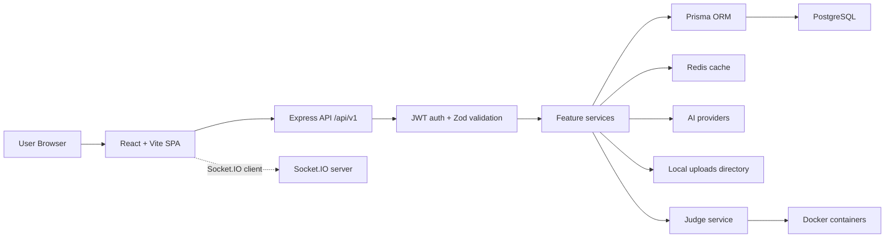
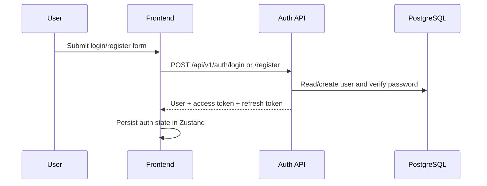
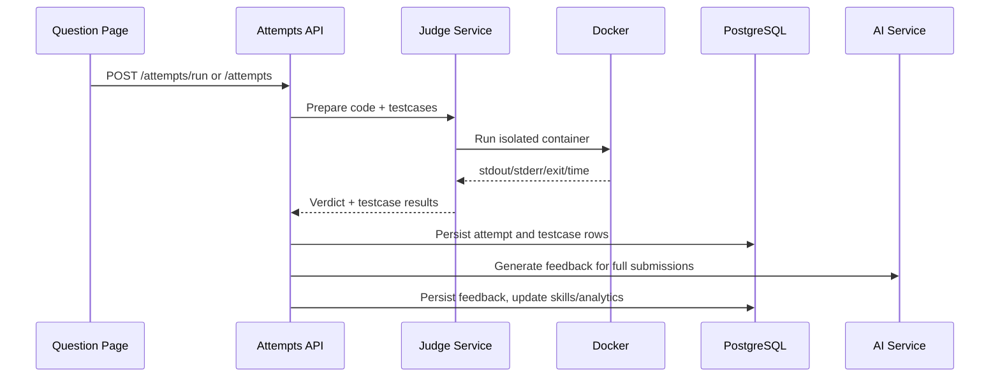

# Smart Interview Preparation Engine - System Design

This document describes the current implemented architecture of SIPE. It intentionally separates what exists today from future scaling ideas.

## 1. Architecture Summary

SIPE is currently a modular monolith:

- React/Vite frontend
- Express/TypeScript backend
- PostgreSQL database through Prisma
- Redis cache
- Docker-based code judge
- Local file uploads for resumes in development
- AI provider integrations for answer evaluation, interview generation, and resume review
- Socket.IO foundation for realtime rooms, while most user workflows currently use REST



## 2. Frontend

The frontend is a React 18 SPA using Vite, TypeScript, Tailwind CSS, React Router, TanStack Query, Zustand, Recharts, Monaco Editor, and Lucide icons.

Implemented route groups:

- Public auth routes: `/login`, `/register`
- Protected user routes: `/dashboard`, `/practice`, `/practice/:slug`, `/mock-interview`, `/mock-interview/:id`, `/analytics`, `/resume`, `/spaced-repetition`, `/learning-path`, `/learning-path/:id`, `/profile`
- Admin routes: `/admin`, `/admin/users`, `/admin/questions`, `/admin/mock-interviews`, `/admin/resumes`

Important frontend patterns:

- `App.tsx` owns route protection and lazy-loaded pages.
- `Layout` and `AdminLayout` provide separate user/admin shells.
- `authStore` persists authentication state and tokens.
- `api.ts` unwraps backend `{ success, data, meta }` envelopes.
- Axios interceptors attach access tokens and refresh expired access tokens.
- TanStack Query handles server state, loading states, retry/refetch behavior, and cache invalidation.
- Shared `StateFeedback` components provide loading, empty, and error states.

## 3. Backend

The backend is an Express app built around feature routes and services.

Current folder pattern:

```text
backend/src/
├── config/       # env, Prisma, Redis, logger
├── judge/        # Docker judge service, runners, output utils
├── middleware/   # auth, validation, error handler, request ID
├── routes/       # Express routers grouped by feature
├── services/     # business logic
├── types/        # TypeScript interfaces
├── utils/        # API serialization helpers
└── server.ts
```

There is no separate `controllers/` layer in the current code. Route handlers are intentionally thin and call service methods directly.

Backend responsibilities:

- Authentication and role authorization
- Request validation
- API envelope responses
- Business workflows
- Database access through Prisma
- Redis cache access
- Resume upload and parsing
- AI feedback and review generation
- Docker code execution
- Admin reporting

## 4. Core User Flows

### 4.1 Authentication



The frontend refreshes access tokens with `POST /api/v1/auth/refresh` when the token is expired or a protected request returns `401`.

### 4.2 Practice and Judge



`Run Code` executes custom stdin without saving an attempt. `Submit` persists the attempt, runs all testcases, stores testcase results, generates feedback, updates skill/analytics data, and may update spaced repetition.

### 4.3 Submission Timeline and Mistake Memory

The question page fetches:

- `GET /api/v1/attempts/questions/:questionId/timeline`

The backend derives timeline data from existing attempt records:

- attempts,
- attempt testcase rows,
- attempt feedback rows.

Mistake Memory groups repeated statuses, repeated failing testcase indexes, and AI feedback weaknesses into concise coaching cards.

### 4.4 Dashboard

`GET /api/v1/dashboard` combines:

- user analytics,
- recommended questions,
- recent interviews,
- spaced repetition summary.

Dashboard responses are cached in Redis for a short TTL.

### 4.5 Resume Review

Resume upload accepts PDF/DOCX files through Multer. Files are stored locally in development, parsed, and analyzed by resume services.

The resume page displays:

- upload status,
- ATS score,
- strengths and weaknesses,
- skill categories,
- priority improvements,
- project analysis,
- experience analysis,
- parsed resume fallback,
- job-description match analysis.

### 4.6 Learning Paths

Learning paths are generated from weak topics. Each path contains ordered items linked to questions where possible. Updating item status recalculates path progress and completes the path when every item is complete.

### 4.7 Spaced Repetition

Spaced repetition entries track interval, repetitions, ease factor, review counts, and next review date. Reviews use an SM-2 style update algorithm and can mark items as mastered after enough successful repetitions.

### 4.8 Admin Operations

Admin pages provide:

- platform stats and user growth,
- judge reliability metrics,
- user search and role/premium/ban updates,
- question CRUD and visibility management,
- mock interview monitoring,
- resume management and protected resume download.

## 5. Data Stores

### PostgreSQL

PostgreSQL is the source of truth for users, skills, questions, attempts, interviews, resumes, learning paths, spaced repetition, analytics, subscriptions, and payments.

### Redis

Redis is used for cache helpers, including:

- dashboard cache,
- user analytics cache,
- leaderboard cache,
- user and skill cache invalidation patterns.

### File Storage

Development resume files are stored under the backend upload directory. Production should move this to S3 or compatible object storage.

## 6. Docker Judge Design

The judge runs code inside temporary Docker containers.

Protections currently used:

- `--network none`
- memory limit
- CPU limit
- PID limit
- dropped capabilities
- `no-new-privileges`
- read-only root filesystem
- temporary `/tmp`
- temporary per-submission workspace
- output truncation
- timeout cleanup

Supported languages:

- JavaScript
- Python
- C++
- Java

## 7. Security

Implemented security controls:

- bcrypt password hashing
- JWT access and refresh tokens
- admin role authorization
- Zod request validation
- Prisma parameterized queries
- Helmet security headers
- CORS allowlist
- global rate limit
- stricter auth rate limit
- request ID middleware
- centralized error handling

Known security/reliability improvement opportunities:

- Authenticate Socket.IO room joins with JWT instead of trusting emitted identifiers.
- Add Redis adapter if Socket.IO must scale horizontally.
- Move resume files to object storage for production.
- Add dedicated judge event table if deeper judge forensics are needed.
- Add frontend tests.

## 8. Deployment Shape

Local development can run PostgreSQL and Redis through Docker while the backend runs on the host. This is the recommended setup for judge development because the backend needs access to the host Docker CLI.

The repository also includes a full `docker-compose.yml` with PostgreSQL, Redis, backend, and frontend services.

Current GitHub deployment workflow deploys the backend to EC2 over SSH, pulls `main`, installs dependencies, generates Prisma client, builds the backend, restarts PM2, and checks `/health`.

## 9. Future Scaling Options

These are not required by the current implementation but are reasonable next steps:

- Use Supabase/RDS connection pooling for Prisma.
- Move long AI calls into Bull/Redis background jobs.
- Store judge lifecycle events separately from attempts.
- Add CDN/static hosting for frontend assets.
- Add read replicas for analytics-heavy workloads.
- Add object storage for uploads.
- Add real Socket.IO interview streaming with authenticated room joins.

