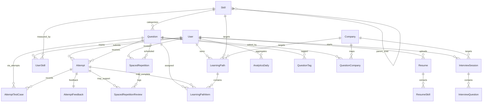

# Smart Interview Preparation Engine - Database Design

This document describes the current PostgreSQL schema as managed by Prisma in `backend/prisma/schema.prisma`.

## 1. Storage Stack

- Database: PostgreSQL
- ORM: Prisma Client
- Schema source: `backend/prisma/schema.prisma`
- Migrations: `backend/prisma/migrations/`
- Seed entrypoint: `backend/prisma/seed.ts`
- Runtime connection: `DATABASE_URL`

Redis is used separately for caching. It is not the source of truth for users, attempts, analytics, or learning progress.

## 2. Domain Groups

### Identity

- `users`: account profile, role, premium state, onboarding state, study preferences, soft-delete timestamp.
- `subscriptions`: premium plan state.
- `payments`: payment records linked to users and optionally subscriptions.

### Content Catalog

- `skills`: hierarchical interview skills with category, ordering, and prerequisites.
- `questions`: coding, system design, behavioral, theoretical, and quiz prompts.
- `tags`: normalized tag names.
- `question_tags`: many-to-many mapping between questions and tags.
- `companies`: company metadata and interview process notes.
- `question_companies`: many-to-many mapping between questions and companies, including frequency and last asked date.

### Practice and Judge

- `attempts`: persisted submissions, code snapshots, language, verdict, timing, testcase counts, AI feedback JSON, interview link, and attempt number.
- `attempt_test_cases`: per-testcase input, expected output, actual output, pass/fail state, execution time, and error message.
- `attempt_feedback`: detailed AI feedback for one attempt, including quality/readability scores, complexity analysis, strengths, weaknesses, suggestions, resources, and related questions.

### Interviews

- `interview_sessions`: mock interview sessions with type, difficulty, company target, schedule, status, scores, transcript, feedback, strengths, and improvement areas.
- `interview_questions`: ordered questions inside an interview session, user answers, AI evaluation, scores, and follow-up flags.

### Resume Intelligence

- `resumes`: uploaded resume file metadata, parsed text/data, detected skills, experience, education, projects, parsing status, and active flag.
- `resume_skills`: extracted skill names with optional linked skill, confidence, years of experience, and context.

### Learning and Review

- `learning_paths`: personalized plans for a user, target skill/company, progress, dates, estimate, and status.
- `learning_path_items`: ordered questions, lessons, reviews, or milestones inside a path.
- `spaced_repetition`: one review schedule per user/question pair, using interval, repetitions, ease factor, review counts, and status.
- `spaced_repetition_reviews`: review events with quality rating, previous/new interval, previous/new ease factor, and optional attempt link.

### Analytics and Activity

- `analytics_daily`: per-user daily aggregates for sessions, time, attempts, solves, accuracy, difficulty breakdown, streak state, and skill breakdown JSON.
- `user_activities`: append-style activity events with metadata.
- `user_skills`: per-user skill proficiency, XP, attempt/solve counts, accuracy, average time, streak days, and last practice timestamp.

## 3. Main Relationships



## 4. Enums

### User and Billing

- `UserRole`: `user`, `premium`, `admin`, `interviewer`
- `PlanType`: `FREE`, `BASIC`, `PREMIUM`, `ENTERPRISE`
- `BillingCycle`: `MONTHLY`, `YEARLY`
- `SubscriptionStatus`: `ACTIVE`, `CANCELLED`, `EXPIRED`, `PAUSED`
- `PaymentStatus`: `PENDING`, `COMPLETED`, `FAILED`, `REFUNDED`

### Content and Practice

- `SkillCategory`: `DATA_STRUCTURES`, `ALGORITHMS`, `SYSTEM_DESIGN`, `BEHAVIORAL`, `LANGUAGE_SPECIFIC`, `FRAMEWORK`
- `Difficulty`: `easy`, `medium`, `hard`, `expert`
- `QuestionType`: `CODING`, `SYSTEM_DESIGN`, `BEHAVIORAL`, `THEORETICAL`, `QUIZ`
- `AttemptStatus`: `PENDING`, `RUNNING`, `ACCEPTED`, `WRONG_ANSWER`, `TIME_LIMIT_EXCEEDED`, `RUNTIME_ERROR`, `COMPILATION_ERROR`, `PARTIALLY_ACCEPTED`

### Interviews and Learning

- `InterviewType`: `TECHNICAL`, `BEHAVIORAL`, `MIXED`, `SYSTEM_DESIGN`
- `InterviewStatus`: `SCHEDULED`, `IN_PROGRESS`, `COMPLETED`, `CANCELLED`, `ABANDONED`
- `PathStatus`: `ACTIVE`, `PAUSED`, `COMPLETED`, `ABANDONED`
- `PathItemType`: `QUESTION`, `LESSON`, `REVIEW`, `MILESTONE`
- `PathItemStatus`: `PENDING`, `IN_PROGRESS`, `COMPLETED`, `SKIPPED`
- `SpacedRepetitionStatus`: `ACTIVE`, `MASTERED`, `PAUSED`

## 5. Key Constraints and Indexes

### Unique Constraints

- `users.email`
- `skills.slug`
- `user_skills(user_id, skill_id)`
- `questions.slug`
- `tags.name`
- `companies.name`
- `companies.slug`
- `question_tags(question_id, tag_id)`
- `question_companies(question_id, company_id)`
- `attempt_feedback.attempt_id`
- `spaced_repetition(user_id, question_id)`
- `analytics_daily(user_id, date)`

### Important Indexes

- Users: `email`, `role`, `is_premium`
- Skills: `category`, `slug`
- User skills: `user_id`, `skill_id`, `proficiency_level`
- Questions: `skill_id`, `difficulty`, `type`, `company_tags`, `topic_tags`, `base_difficulty_score`
- Attempts: `user_id`, `question_id`, `status`, `submitted_at`, and combined `user_id + question_id`
- Interviews: `user_id`, `status`, `scheduled_at`
- Spaced repetition: `user_id`, `next_review_date`, and combined `user_id + next_review_date`
- Analytics: `user_id + date`, `date`
- User activity: `user_id`, `activity_type`, `created_at`

## 6. Submission Timeline Data

The Submission Timeline feature reads from:

- `attempts` for submission order, verdicts, code snapshots, language, attempt number, execution metrics, and AI summary.
- `attempt_test_cases` for failed testcase memory, actual/expected output, and recurring error signatures.
- `attempt_feedback` for mistake themes, weaknesses, strengths, suggestions, and complexity observations.

There is no separate timeline table. The timeline is derived from persisted attempts for the authenticated user and selected question.

## 7. Mistake Memory Data

Mistake Memory is also derived rather than stored as a separate entity. The backend groups historical failed submissions by:

- verdict,
- testcase error message,
- AI feedback weaknesses,
- AI improvement suggestions,
- recurring failed testcase signatures.

This keeps the feature consistent with the source attempt history and avoids maintaining duplicate mistake state.

## 8. Judge Reliability Data

The admin Judge Reliability dashboard reads existing judge data from:

- `attempts.status`
- `attempts.language`
- `attempts.execution_time`
- `attempts.submitted_at`
- `attempt_test_cases.error_message`
- `attempt_test_cases.execution_time`

Metrics such as accepted rate, failure rate, timeout rate, compilation error rate, runtime error rate, language breakdown, top error signatures, and recent failures are calculated at request time for the selected time window.

## 9. Delete Behavior

Most child records use cascading deletes through Prisma relations. For example:

- deleting a user removes their attempts, resumes, analytics, user skills, learning paths, and spaced repetition records;
- deleting a question removes attempts, question tags, company links, and spaced repetition records tied to that question;
- deleting an attempt removes testcase rows and feedback.

User-facing account deletion is implemented as a soft delete in the user service by setting `deleted_at`; hard delete behavior is still represented in the relational model for administrative or maintenance operations.

## 10. JSON Fields

The schema intentionally uses JSON for flexible AI- and content-shaped data:

- `questions.starter_code`
- `questions.solution_code`
- `questions.test_cases`
- `attempts.ai_feedback`
- `attempt_feedback.recommended_resources`
- `interview_sessions.ai_interviewer_config`
- `resumes.parsed_data`
- `resumes.skills_detected`
- `resumes.education`
- `resumes.projects`
- `analytics_daily.skill_breakdown`
- `user_activities.metadata`

When adding new user-visible features, prefer typed relational fields for query-critical data and JSON only for flexible metadata or AI outputs.

## 11. Migration Workflow

Development:

```bash
cd backend
npm run db:migrate
npm run db:generate
```

Production:

```bash
cd backend
npm run db:deploy
npm run db:generate
```

Seeding:

```bash
cd backend
npm run db:seed
```

Validation:

```bash
cd backend
npx prisma validate
```

## 12. Operational Notes

- The app currently relies on application-level authorization instead of database row-level security.
- Prisma maps many enum values to lower-case database values, so API docs should use the frontend/backend contract rather than raw database strings unless explicitly discussing storage.
- Supabase direct database URLs can produce transient `P1001` errors if the host is unavailable or connection limits are reached. For production app traffic, use a pooled connection string when available.
- Uploaded resume files are stored on disk in `UPLOAD_DIR`; the database stores file metadata and the relative URL/path.
