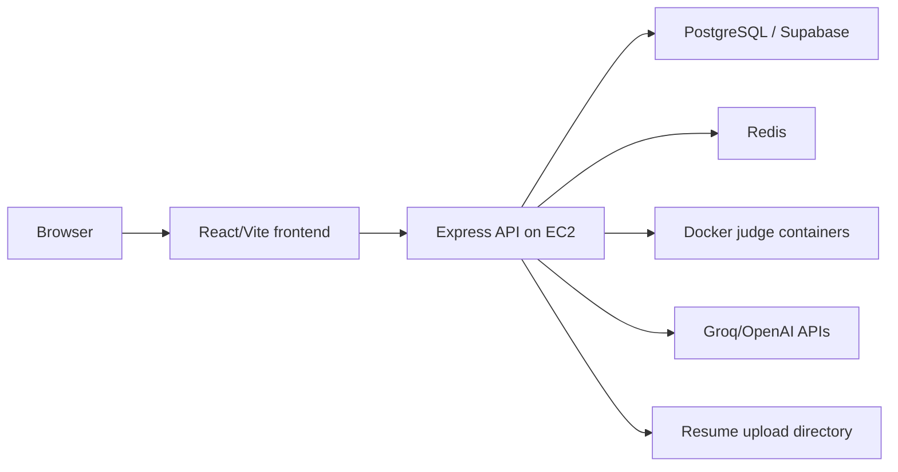

# Smart Interview Preparation Engine - Deployment Guide

This guide documents the current deployment shape and the operational requirements of the app.

## 1. Current Production Shape

The repository currently includes a backend deployment workflow for an EC2 host:

- Workflow file: `.github/workflows/deploy.yml`
- Trigger: push to `main`
- Target: EC2 over SSH
- Runtime manager: PM2
- Backend health check: `http://localhost:10000/health`



The frontend can be deployed as static files from `frontend/dist` to any static hosting provider. The backend must run on infrastructure that supports Node.js, long-running processes, Docker, and outbound network access to the database, Redis, and AI providers.

## 2. Runtime Requirements

### Backend

- Node.js 20.x
- npm
- PostgreSQL database reachable through `DATABASE_URL`
- Redis reachable through `REDIS_URL`
- Docker installed and usable by the backend process for code execution
- PM2 or another process manager in production
- Persistent filesystem path for uploads, or an external object storage replacement

### Frontend

- Node.js 20.x for builds
- Static hosting for built assets
- `VITE_API_URL` pointing to the backend API base URL

## 3. Backend Environment Variables

These values are validated in `backend/src/config/env.ts`.

Required:

```bash
NODE_ENV=production
PORT=10000
API_VERSION=v1
DATABASE_URL="postgresql://..."
REDIS_URL="redis://..."
JWT_SECRET="minimum-32-character-secret"
JWT_REFRESH_SECRET="minimum-32-character-refresh-secret"
CORS_ORIGIN="https://your-frontend-domain.com"
```

Common optional/defaulted values:

```bash
JWT_EXPIRES_IN="7d"
JWT_REFRESH_EXPIRES_IN="30d"
RATE_LIMIT_MAX=100
OPENAI_API_KEY="..."
OPENAI_MODEL="gpt-4-turbo-preview"
GROQ_API_KEY="..."
GROQ_MODEL="llama-3.3-70b-versatile"
MAX_FILE_SIZE=5242880
UPLOAD_DIR="uploads"
DOCKER_BINARY="docker"
JUDGE_TEMP_DIR="tmp/judge"
JUDGE_RUN_TIMEOUT_MS=3000
JUDGE_COMPILE_TIMEOUT_MS=10000
JUDGE_MEMORY_LIMIT="512m"
JUDGE_CPU_LIMIT="0.5"
JUDGE_PIDS_LIMIT=64
JUDGE_IMAGE_JAVASCRIPT="node:20-alpine"
JUDGE_IMAGE_PYTHON="python:3.12-alpine"
JUDGE_IMAGE_CPP="gcc:13-bookworm"
JUDGE_IMAGE_JAVA="eclipse-temurin:21-jdk-alpine"
SMTP_HOST="..."
SMTP_PORT=587
SMTP_USER="..."
SMTP_PASS="..."
AWS_ACCESS_KEY_ID="..."
AWS_SECRET_ACCESS_KEY="..."
AWS_S3_BUCKET="..."
AWS_REGION="us-east-1"
```

Notes:

- `DIRECT_URL` appears in `.env.example`, but the current Prisma datasource only reads `DATABASE_URL`.
- If Supabase is used, prefer the pooled connection string for app traffic when available.
- AI features degrade to fallback behavior when provider keys are missing, depending on the service path.

## 4. Frontend Environment Variables

Create `frontend/.env` for local development or configure the same variable in static hosting:

```bash
VITE_API_URL="https://your-api-domain.com/api/v1"
```

For local development:

```bash
VITE_API_URL="http://localhost:3000/api/v1"
```

## 5. Local Build and Validation

Backend:

```bash
cd backend
npm install
npm run db:generate
npm run typecheck
npm run build
```

Frontend:

```bash
cd frontend
npm install
npm run build
```

Database validation:

```bash
cd backend
npx prisma validate
```

Production migration:

```bash
cd backend
npm run db:deploy
```

Seed data:

```bash
cd backend
npm run db:seed
```

## 6. Current GitHub Actions Deployment

The actual workflow is:

1. Checkout happens on the EC2 host through SSH.
2. The script enters `~/SIPE/backend`.
3. It fetches `origin/main`.
4. It hard-resets the server working tree to `origin/main`.
5. It runs `npm install`.
6. It runs `npx prisma generate`.
7. It runs `npm run build`.
8. It restarts `pm2` process `sipe-backend`.
9. It checks `/health` on localhost port `10000`.

Required GitHub secrets:

```bash
EC2_HOST
EC2_USER
EC2_SSH_KEY
```

Required EC2 setup:

- repo cloned at `~/SIPE`
- backend `.env` present on the server
- Node.js 20 installed
- npm installed
- PM2 installed
- PM2 app named `sipe-backend`
- Docker installed and running
- database and Redis network access configured

## 7. Backend PM2 Setup

One straightforward setup on the EC2 host:

```bash
cd ~/SIPE/backend
npm install
npx prisma generate
npm run build
pm2 start dist/server.js --name sipe-backend
pm2 save
```

When environment variables change:

```bash
pm2 restart sipe-backend --update-env
```

## 8. Database Deployment

Use Prisma migrations:

```bash
cd backend
npm run db:deploy
```

Operational recommendations:

- keep migration deployment separate from app boot when possible;
- back up production data before schema changes;
- use a pooled database URL for application traffic;
- monitor Prisma `P1001` errors because they usually indicate network, pool, or database availability issues.

## 9. Docker Judge Deployment

The judge executes submitted code inside Docker containers. Production hosts need:

- Docker daemon running;
- backend process user allowed to run Docker;
- language images pulled or pullable:
  - `node:20-alpine`
  - `python:3.12-alpine`
  - `gcc:13-bookworm`
  - `eclipse-temurin:21-jdk-alpine`
- a writable `JUDGE_TEMP_DIR`;
- CPU, memory, process, compile timeout, and run timeout limits configured.

Useful pre-pull command:

```bash
docker pull node:20-alpine
docker pull python:3.12-alpine
docker pull gcc:13-bookworm
docker pull eclipse-temurin:21-jdk-alpine
```

## 10. Static Frontend Deployment

Build output:

```bash
cd frontend
npm run build
```

Deploy the `frontend/dist` directory to a static host such as Nginx, S3/CloudFront, Netlify, Vercel, or any equivalent provider.

For React Router support, configure the host to serve `index.html` for unknown paths. With Nginx:

```nginx
location / {
  try_files $uri $uri/ /index.html;
}
```

## 11. Health Checks

Backend:

```bash
curl http://localhost:10000/health
curl http://localhost:10000/health/db
```

The first endpoint checks the server process. The second checks database connectivity through Prisma.

## 12. Logging and Monitoring

Current backend logging uses Winston and request logging middleware.

Recommended production checks:

- PM2 process status and restart count;
- backend logs for Prisma `P1001`, judge failures, and auth rate limits;
- database connection count and CPU;
- Redis availability;
- disk usage for `uploads`, `logs`, and judge temp directories;
- admin Judge Reliability dashboard for verdict distribution and recurring judge errors.

## 13. Security Checklist

- Use HTTPS in front of both frontend and backend.
- Set `CORS_ORIGIN` to the exact frontend origin.
- Keep JWT secrets at least 32 characters and rotate them if exposed.
- Do not commit `.env` files.
- Restrict SSH access to the EC2 host.
- Keep Docker updated.
- Run the judge with conservative CPU, memory, timeout, and PID limits.
- Keep upload size limits enabled.
- Keep admin accounts limited and audited.
- Run `npm audit` and dependency upgrades periodically.

## 14. Known Deployment Gaps

- Frontend deployment is not currently automated in `.github/workflows/deploy.yml`.
- The workflow does not run backend tests before deployment.
- The frontend package does not currently define an `npm test` script.
- Upload storage is local by default; production should use a persistent volume or object storage strategy.
- The backend workflow uses `git reset --hard` on the server copy, so server-local source edits under `~/SIPE` will be discarded on deploy.
