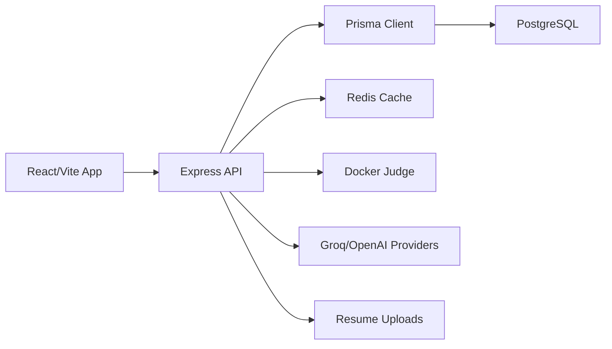

# Smart Interview Preparation Engine - Current Project Analysis

Last reviewed against the codebase on June 13, 2026.

## 1. Executive Summary

Smart Interview Preparation Engine is a full-stack interview preparation platform with a React/Vite frontend and a TypeScript Express backend. The product currently supports authentication, dashboard analytics, coding practice, Docker-based judging, submission history, mistake memory, spaced repetition, learning paths, mock interviews, resume analysis, and an admin console.

The implementation is best described as a modular monolith rather than a microservices system. Feature routers call service classes directly, Prisma manages PostgreSQL access, Redis supports caching, and Docker containers isolate code execution.

## 2. Current Strengths

- Broad feature coverage across practice, analytics, spaced repetition, interviews, resume intelligence, and administration.
- Strong TypeScript coverage on both frontend and backend.
- Prisma schema captures most core product domains cleanly.
- Practice page has a real coding workflow with Monaco Editor, run, submit, testcase results, AI feedback, Submission Timeline, and Mistake Memory.
- Admin dashboard now includes Judge Reliability metrics instead of only static system-health copy.
- Backend exposes health endpoints for server and database checks.
- Docker judge has language-specific containers, compile/run stages, timeouts, resource limits, and testcase persistence.
- README and docs now reflect the implemented system more closely than the original aspirational architecture.

## 3. Current Architecture



### Frontend

- React 18 with TypeScript and Vite.
- React Router for navigation.
- TanStack Query for server state.
- Zustand for auth/application state.
- Tailwind CSS for styling.
- Monaco Editor for coding.
- Recharts for analytics visualizations.
- Admin pages for platform oversight.

### Backend

- Express with TypeScript.
- Route modules under `backend/src/routes`.
- Service modules under `backend/src/services`.
- Prisma/PostgreSQL persistence.
- Redis cache helpers.
- Socket.IO server initialized for real-time features.
- Zod validation middleware.
- JWT authentication and role authorization.
- Winston logging.

### Data

The Prisma schema includes users, skills, questions, attempts, attempt testcases, attempt feedback, interview sessions, interview questions, resumes, resume skills, learning paths, spaced repetition, analytics, activities, subscriptions, payments, tags, and companies.

## 4. Implemented User Features

### Authentication and Profile

- Registration and login.
- Refresh token support.
- Current-user endpoint.
- Password change.
- Stateless logout response.
- Profile updates.
- Skill profile management.
- Soft account deletion through user service.

### Dashboard

- Aggregated dashboard data.
- Analytics summary cards.
- Recommendations.
- Recent interview data.
- Spaced repetition summary.

### Coding Practice

- Question list, filtering, search, recommendations, due reviews, and company-specific question routes.
- Question detail page with problem statement, constraints, hints, tags, examples/testcases, editor, run, submit, and feedback.
- Supported judge languages: JavaScript, Python, C++, Java.
- Custom input run endpoint that does not persist an attempt.
- Persisted submit endpoint that stores attempts and testcase rows.
- Submission Timeline for a question.
- Mistake Memory derived from past failed submissions and feedback.
- Load-code action from previous attempts.
- Polling for in-progress attempts.

### Analytics

- Overall attempts and accepted counts.
- Accuracy and daily progress.
- Skill breakdown.
- Weak and strong topics.
- Streak information.
- Leaderboard endpoint.

### Spaced Repetition

- Due reviews.
- Add/remove question.
- Submit quality rating.
- Reset review progress.
- Stats endpoint.
- SM-2-style fields for interval, repetitions, and ease factor.

### Learning Paths

- List, create, detail, pause, resume, delete paths.
- Update learning path item status.
- Progress tracking through completed and total items.

### Mock Interviews

- Create interview sessions.
- List and inspect sessions.
- Start, answer current question, skip, complete, cancel, and delete.
- Store scores, transcript, feedback, strengths, and improvement areas.

### Resume Intelligence

- Upload resume files.
- Store parsed text/data, detected skills, education, projects, and parsing status.
- Current resume endpoint.
- Skill gap analysis.
- Personalized question list.
- Job description matching.
- Admin resume oversight and protected download.

### Admin

- Platform stats.
- Signup growth chart.
- User list and updates.
- Question list, create, edit, delete.
- Skills lookup for question forms.
- Interview monitoring.
- Resume listing/download.
- Judge Reliability dashboard with:
  - total attempts in selected window;
  - accepted/failure/in-progress counts;
  - success, failure, timeout, compile error, and runtime error rates;
  - average and max execution time;
  - verdict breakdown;
  - language breakdown;
  - top error signatures;
  - recent failures.

## 5. Recently Added Improvements

### Submission Timeline

The question page now shows historical attempts for the selected question. Users can inspect verdicts, pass rates, execution metrics, code snapshots, failed testcase details, feedback summaries, and load older code into the editor.

### Mistake Memory

The backend derives recurring mistake patterns from failed attempts, failed testcase rows, and feedback. This helps users recognize repeated failure modes such as runtime errors, wrong-answer patterns, compilation issues, or repeated weaknesses.

### Judge Reliability Dashboard

Admin users can now monitor judge health from real attempt/testcase data. This is useful for detecting language-specific problems, timeout spikes, recurring Docker/runtime errors, and recent failing submissions.

## 6. Technical Risks and Gaps

### Production Judge Isolation

The judge uses Docker limits, but production hardening should still include host-level isolation, restricted Docker permissions, network restrictions inside containers, and ongoing image patching.

### Deployment Automation

Only backend EC2 deployment is automated in `.github/workflows/deploy.yml`. Frontend deployment is still manual or external to this repository.

### Test Coverage Visibility

Backend has Jest scripts, but current documentation should not claim broad test coverage unless measured. Frontend has no `npm test` script.

### Upload Storage

Resume uploads use local storage by default. Production should use persistent disk or object storage, especially if the backend runs on replaceable hosts.

### AI Provider Reliability

AI-backed features should continue to use fallbacks, timeouts, and clear UI states because provider latency and quota errors are expected operational realities.

### Prisma Connection Stability

Supabase direct database connections can produce transient `P1001` failures. Production app traffic should use connection pooling where available.

## 7. Recommended Next Improvements

### High Impact

- Add persistent judge event logging for better reliability analysis over time.
- Add backend tests for attempt submission, timeline generation, mistake memory grouping, and judge reliability metrics.
- Automate frontend deployment.
- Add CI checks for backend typecheck/build and frontend build on pull requests.
- Add frontend empty/error/loading states audit across all pages.

### Medium Impact

- Add richer filters to Submission Timeline by verdict/language.
- Add downloadable attempt history for users.
- Add admin audit log for user/question changes.
- Add resume upload replacement flow with active/inactive history controls.
- Add explicit cache invalidation tests.

### Longer Term

- Move judge execution to a separate worker service or queue if traffic grows.
- Add a separate telemetry table for judge events.
- Add organization/team mode for cohorts or classrooms.
- Add websocket-backed live interview state if real-time collaboration becomes a core requirement.
- Add billing integration if premium features need real payment enforcement.

## 8. Development Commands

Backend:

```bash
cd backend
npm run dev
npm run typecheck
npm run build
npm test
npm run db:generate
npm run db:migrate
npm run db:deploy
npm run db:seed
```

Frontend:

```bash
cd frontend
npm run dev
npm run build
npm run lint
npm run preview
```

## 9. Current Documentation Set

- `README.md`: broad product and developer guide.
- `docs/01-SYSTEM-DESIGN.md`: current system architecture.
- `docs/02-DATABASE-DESIGN.md`: Prisma/PostgreSQL schema guide.
- `docs/03-BACKEND-DESIGN.md`: backend modules, routes, services, and judge flow.
- `docs/09-DEPLOYMENT.md`: deployment requirements and current EC2 workflow.
- `docs/12-RESUME-DESCRIPTION.md`: truthful resume/portfolio wording.
- `docs/PROJECT_ANALYSIS.md`: current implementation analysis and recommended next work.
