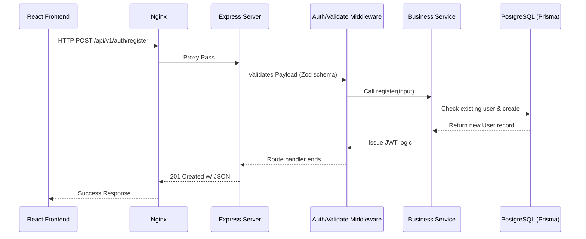
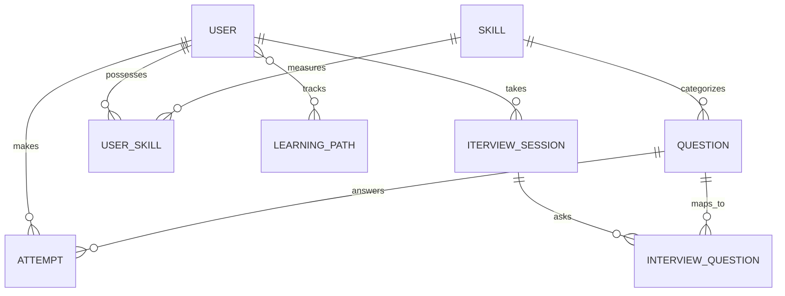

# Smart Interview Preparation Engine (SIPE) - Project Analysis

This document provides a comprehensive, code-level analysis of the **Smart Interview Preparation Engine** codebase. It is designed to deep-dive into the app's architecture, workflows, APIs, databases, and implementation facts, specifically tailored for advanced technical interview preparation.

---

## 1. Project Overview

### What the Project Does
SIPE is an AI-driven adaptive interview preparation platform. It allows users to simulate mock interviews (technical, behavioral, system design), practice coding algorithms in an integrated editor, track their learning paths, manage spaced repetition reviews, and parse resumes using AI to provide customized interview feedback.

### Main Features
- **Adaptive Mock Interviews:** AI-generated and conversational interviews tracking performance over time.
- **Interactive Coding Practice:** Embedded code editor (Monaco Editor) with standard coding problems, hints, and algorithm solutions.
- **Analytics & Spaced Repetition:** Smart flashcard/question scheduling to optimize algorithmic retention.
- **Resume Analysis:** Automated resume review extracting skills and generating targeted study plans.

### Tech Stack
- **Frontend:** React 18 (Vite), TypeScript, Tailwind CSS, Zustand (State), React Query (Data Fetching), Monaco Editor, Socket.IO Client.
- **Backend:** Node.js (Express), TypeScript, Prisma ORM, Bull (Task Queue), ioredis (Caching/Sessions), Socket.IO (Real-time).
- **Database:** PostgreSQL (Primary), Redis (Cache & Queue).
- **AI & Integrations:** OpenAI API (GPT models for question generation/evaluation).
- **Deployment:** Docker, Docker Compose, Nginx.

### High-Level Architecture
The architecture is a modular monolith. Nginx or Vite serves the React SPA frontend. The unified Express backend connects to a PostgreSQL database via Prisma ORM for persistent data, and Redis for rate-limiting, queues, and short-term caching. Real-time communication occurs over WebSockets (Socket.IO).

---

## 2. Folder Structure

```text
interview-prep-engine/
├── backend/                  # Node.js + Express + Prisma Monolith
│   ├── prisma/
│   │   ├── schema.prisma     # Central DB schema & DB models
│   │   ├── seed.ts           # Initial DB state (tags, default questions)
│   │   └── migrations/       # SQL migration history
│   ├── src/
│   │   ├── config/           # Setup for ENV (Zod parsed), DB, Redis, Bull
│   │   ├── middleware/       # Auth (JWT), Validation (Zod), Error Handling (Global)
│   │   ├── routes/           # Express Routers grouped by feature
│   │   ├── services/         # Business logic layer modules (Auth, AI, Interview, etc.)
│   │   ├── types/            # TypeScript interfaces & declarations
│   │   ├── utils/            # Helper functions
│   │   └── server.ts         # Bootstraps Express, adds helmet, cors, starts socket.io
├── frontend/                 # React + Vite application
│   ├── src/
│   │   ├── components/       # Shared UI components & Layouts (AdminLayout, Sidebar)
│   │   ├── pages/            # View components (Practice, MockInterview, Auth, Admin)
│   │   ├── services/         # API SDK via Axios with token interceptors
│   │   ├── store/            # Zustand stores for global auth/session state
│   │   ├── types/            # TypeScript interfaces for API payloads & state
│   │   ├── App.tsx           # React Router routing logic
│   │   └── main.tsx          # Root React entry & React Query Client Provider
│   ├── Dockerfile            # Containerizes frontend using Vite build -> Nginx
│   └── nginx.conf            # Nginx config serving static files and proxy
├── docs/                     # System design diagrams and architecture notes
└── docker-compose.yml        # Multi-container orchestration (Postgres, Redis, API)
```

---

## 3. Application Flow

### Request Flow
1. **Frontend Request:** The React frontend makes a request to the backend using Axios via `api.ts`.
2. **Interceptors:** Axios interceptors attach a Bearer JWT Token automatically (kept in Zustand/localStorage).
3. **Gateway/Reverse Proxy (Production):** Nginx routes the request to the upstream Node container on port 3000.
4. **Backend Middleware:** The request hits `server.ts` -> passes through `helmet` (security headers), `express-rate-limit`, `morgan` (logging), and `requestId`.
5. **Authentication & Validation Layer:** Protected routes run the `authenticate` middleware (verifies JWT inside headers). Then, `validate` (Zod) validates request bodies and query parameters.
6. **Services & Database:** The Controller forwards the trusted payload to a Service (e.g., `auth.service.ts`). The Service invokes Prisma to query/write to PostgreSQL, and may talk to OpenAI via `ai.service.ts`.
7. **Response:** The result returns uniformly back through the Controller to the Client.



---

## 4. Frontend Analysis

- **Routing:** Centralized in `App.tsx` using `react-router-dom`. Routes are wrapped in ternary checks restricting access (e.g., `<Route element={isAuthenticated ? <DashboardPage /> : <Navigate to="/login" />}` ). Admin-specific routes check `user?.role === 'admin'`.
- **State Management:** Handled natively by **Zustand** (`src/store/authStore.ts`), combined with the `persist` middleware so local storage survives reloads. Server data state relies heavily on **React Query**, drastically reducing boilerplate fetching variables (`isLoading`, `isError`).
- **API Calling Logic:** A customized Axios instance (`api.ts`) contains pre-flight request interceptors (attaching `Authorization: Bearer <Token>`) and response interceptors (for transparently handling 401 Unauthorized token-refresh mechanisms using `refreshToken`).
- **Interactive Layers:** Uses `@monaco-editor/react` to render an IDE in the browser for coding problems (`PracticePage.tsx`, `QuestionPage.tsx`), and integrates `Socket.IO-client` for real-time interview transcripts.
- **Component Styling & Architecture:** Follows modern Tailwind utility-first patterns. Employs `clsx` and `tailwind-merge` allowing for highly dynamic conditional tailwind classes in reusable components.

---

## 5. Backend Analysis

- **Server Setup:** Express is instantiated directly in `src/server.ts` connected via the typical HTTP module to `Socket.io` instances sharing identical server-layer CORS constraints.
- **Validation:** Utilizes `Zod` exclusively for input validation mapped specifically to a custom middleware (`validate({ body, query, params })`) before ANY route hits a controller. Example: Data constraints for `password` force upper/lower/numbers and length of 8.
- **Error Handling:** Centralized with an `errorHandler.ts` middleware resolving `ApiError` class instances, stripping stack-traces out of production API responses naturally. 
- **Business Logic Layer Model:** Thin controllers (`routes.ts`) simply parse the req/res lifecycle object and immediately hand-off the logic to stateless Service classes (e.g., `interview.service.ts`), simplifying testability.

### Example Important API Endpoint

**Create Interview Session**
- **Method & Route:** `POST /api/v1/interviews`
- **Purpose:** Initiates a new adaptive mock interview session for the requesting user.
- **Middleware:** `authenticate` (requires JWT), `validate({ body: createInterviewSchema })`.
- **Business Logic:** `interviewService.createInterview()`
- **DB Operations:** Validates User constraints, initializes new `InterviewSession` status in PostgreSQL, randomly maps matching `Question` nodes from AI generators if none are strictly supplied.

---

## 6. Database Analysis

The PostgreSQL database relies exclusively on Prisma (`schema.prisma`) featuring excellent strongly-typed relationships.

### Important Tables & Models
- **`User`**: Tracks `email`, `role`, authentication details, settings, and subscription states. Strongly associated directly with dozens of models utilizing `id` (UUID).
- **`Skill` / `UserSkill`**: Forms a graphical hierarchy of computer-science and behavioral traits and models exactly how proficient the user is matching the concepts.
- **`Question`**: Houses coding/behavioral questions including metadata like `starter_code`, `solution_code`, `test_cases` (saved gracefully as JSON), and difficulty. Maps directly to `Company` or `Tag` through distinct joining entities.
- **`InterviewSession`**: Links users to active timed interviews. 
- **`SpacedRepetition`**: Keeps an algorithmic tracking interval (SuperMemo-like) assessing when users must retry questions.

### Entity-Relationship (Partial Concept)


---

## 7. Important Workflows

### 1. Authentication Flow (JWT with Refresh Rotation)
1. User supplies email/password inside React.
2. Backend verifies bcrypt equality against stored hash in Prisma.
3. System provisions a short-lived `AccessToken` and long-lived `RefreshToken`.
4. The client uses `AccessToken` per request. Upon expiry, the frontend Axios interceptor intercepts the `401 Unauthorized`, sends the `RefreshToken` to the Auth service refresh endpoint, and seamlessly retries the delayed original API call.

### 2. Spaced Repetition (Learning Curve Mechanism)
1. User attempts a mock interview code or algorithm.
2. Based heavily on success metrics (Time to Finish, Optimal Space/Time Complexity efficiency, Test-cases passed), a `SpacedRepetitionReview` calculates an updated review date interval.
3. A CRON/Bull worker maps background jobs. Scheduled questions surface in the `SpacedRepetitionPage.tsx` interface on specific dates to enhance learning retention.

### 3. AI Generated Interviews / Evaluation
1. Interview created natively via React UI -> API proxy.
2. The user interacts through a live interview sequence. Transcripts might stream iteratively via websockets to the `Backend -> AI Service`.
3. `ai.service.ts` constructs system context blocks natively passing them into standard `OpenAI GPT-4` LLMs.
4. AI evaluates constraints, scoring the user 1-100 on code optimization, and feeds data accurately back down the pipeline rendering final `AnalyticsDaily` matrices.

---

## 8. Security & Performance

### Security
1. **Password Safety:** Exclusively relies on robust `bcrypt` (12 rounds of salt).
2. **Access Security:** Dual-layer JWT logic mitigates stolen tokens from persisting forever; endpoints mandate verification on highly private user objects via `id` identity comparisons.
3. **Protection Middlewares:** Implements `helmet()` for Strict Content Security Policy/Headers. 
4. **Rate Limiting:** Prevents brute force usage via `express-rate-limit` (General 100 reqs/15m, Auth endpoints pinned heavily to 5 reqs/15m).

### Performance Optimization
- **Zustand & React Query Cache:** In the frontend, state does not constantly refetch unmutated data minimizing loading waterfalls wildly.
- **Index Optimization:** Database tables inside Prisma contain heavy composite/isolated indices (e.g. `@@index([skillId])`, `@@index([difficulty])`) speeding up massive list queries substantially.
- **Redis Integration:** Caches transient state variables minimizing heavy PostgreSQL IO load cycles under high user concurrency.

---

## 9. Deployment & Environment

- **Infrastructure Initialization:** Handled natively via a robust `docker-compose.yml`.
- **Containers:** 
  1. `postgres` (PostgreSQL 16)
  2. `redis` (Redis 7 Alpine)
  3. `backend` (Custom Node container building Vite/TypeScript dist dynamically)
  4. Nginx handles strictly static bundle rendering directly on the root web container.
- **Environment Variables:** Loaded strictly relying on `dotenv`. Validated on boot globally via `zod` (`src/config/env.ts`) so the backend fundamentally crashes immediately on spin-up if configuration secrets (i.e. `DATABASE_URL` or `JWT_SECRET`) are missing. 

---

## 10. Interview Preparation Section

### 1-Minute Elevator Pitch
"SIPE is a full-stack, AI-driven adaptive interview preparation platform built with React, Node.js, and PostgreSQL. It allows engineers to practice coding problems securely in an embedded Monaco editor, generates dynamic real-time mock interviews evaluated by OpenAI integration, and tracks user retention iteratively utilizing custom spaced repetition logic heavily driven by Bull MQ workers."

### 3-Minute Technical Pitch
"The system is architected as a modular monolith utilizing Express and Prisma. On the frontend, I leveraged React 18 with Vite, implementing Zustand for global UI state and React Query for caching extensive data fetching natively. Real-time aspects, like live interview sessions, are managed gracefully with Socket.io. For the backend framework, Express manages RESTful endpoints entirely validated iteratively through Zod schemas. These pipe down to single-responsibility service patterns. For data, Prisma ORM communicates directly over a PostgreSQL database handling highly normalized complex relationships, such as Skills nested to Users resolving against Questions. Redis serves iteratively as a session manager and job-queue cache avoiding excess DB reads on leaderboards or heavily trafficked public questions. Environment configurations are typed strictly natively, deployed fully containerized utilizing Docker standardizing both environments and deployment stability seamlessly."

### Common Interviewer Questions & Answers

**Q: Why use Zustand alongside React Query? Why not just use Redux for everything?**
> "React Query strictly organizes remote asynchronous server-state (like user progress, question lists), providing immense benefits out of the box like retry-logic, cache invalidation, and polling. Zustand handles ephemeral Client UI state (like managing active theme, simple active session triggers). Redux implies a larger boilerplate overhead, whereas delegating remote logic to React Query cleanly limits global state entirely."

**Q: How do you handle JWT refreshing? What if multiple API calls trigger the refresh simultaneously?**
> "In `api.ts`, Axios interceptors are designed directly to resolve 401s inherently. For concurrency, the interceptor uses a Promise lock (`refreshPromise`). If a request triggers a refresh while another token is currently refreshing, subsequent requests gracefully `await` the resolving promise preventing race condition errors or generating redundant refresh token requests heavily throttling DB authentication limits."

**Q: If we hit rapid database scaling issues due to user growth, what is your next bottleneck and how would you fix it?**
> "The first bottleneck is generally connection-pooling hitting PostgreSQL directly. Moving Prisma instance logic behind `pgbouncer` minimizes pool explosion significantly. Secondly, standardizing frequent reads—like loading standardized algorithm questions from the DB to Redis caching instances entirely removes read constraints significantly scaling the architecture."

**Q: How is security handled on route inputs?**
> "Strongly typed via Zod validation inside an early-stage middleware layer. The route logic inherently cannot fire unless the `req.body` and `req.params` correspond cleanly against predefined types, inherently destroying NoSQL injection variants natively."

---

## 11. Key Learnings & Improvements

**Good Design Choices:**
- Isolating route definition strictly from services using thin-controllers yields immense testing advantages.
- The `env.ts` config utilizing `.zod` validation ensures the application outright fails to start in Docker environments lacking proper deployment secrets, an essential component for ops stability safely.

**Technical Debt & Possible Improvements:**
- Currently, handling web-socket (Socket.IO) horizontal scaling intrinsically requires standardizing a Redis Adapter natively so broadcasting events scales effectively across parallel Node.js Docker containers inside production clusters safely. 
- The codebase identifies modular monolith tendencies. If 'AI Processing' takes exceedingly long on huge prompts, abstracting the `ai.service.ts` into a truly independent microservice consuming explicitly off a RabbitMQ pipeline ensures the Node event-loop doesn't lock up or drop real-time frontend concurrent sessions unexpectedly.

**Scalability Suggestions:**
- Incorporate a CDN explicitly (CloudFront/Cloudflare) wrapping the Nginx servers statically delivering React PWA assets instantly, strictly limiting server transit costs cleanly natively. 
- Implement read-replicas directly configured inside Prisma to offload intense analytical queries targeting heavily aggregated data generated inherently by the learning retention systems globally.